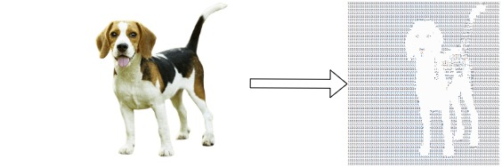

# Image2AsciiConverter
A simple Image2ascii converter written in python.

## Execution

1. Clone the repository to local machine.
```
git clone https://github.com/JohnNellas/Image2AsciiConverter.git
```

2. Install the required modules from the ```requirements.txt``` file.
```
pip install -r requirements.txt
```

3. See the documentation of the example script.
```
python3 example.py --help

usage: example.py [-h] -p IMAGEPATH -s SAVEPATH [--resizeFlag] [--noResizeFlag] [--invertFlag] [--noInvertFlag] [-w TARGETWIDTH] [-g TARGETHEIGHT]

A simple python script for converting an image to an ascii image.

optional arguments:
  -h, --help            show this help message and exit
  -p IMAGEPATH, --imagePath IMAGEPATH
                        Path to the image.
  -s SAVEPATH, --savePath SAVEPATH
                        Path containing the output of the program.
  --resizeFlag          Specify if resize is desired.
  --noResizeFlag        Specify if no resize is desired.
  --invertFlag          Specify if image invertion is desired.
  --noInvertFlag        Specify if no image invertion is desired.
  -w TARGETWIDTH, --targetWidth TARGETWIDTH
                        The target image width
  -g TARGETHEIGHT, --targetHeight TARGETHEIGHT
                        The target image height for the image resize.
```

## Example
Run an example that utilizes the converter class. In more detail convert the image contained in path ```./dog.png``` , save the ascii image at the path ```./dogAscii.txt```, invert the loaded image and resize it to 256x100.
```
python3 example.py -p ./dog.png -s ./dogAscii.txt --invertFlag --resizeFlag -w 150 -g 100
```

### Result




